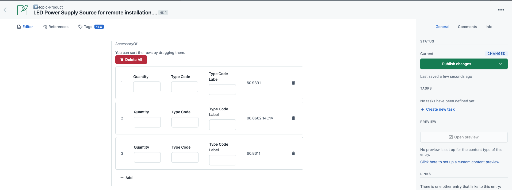

# Contentful Repeater Field App

This project was bootstrapped with [Create Contentful App](https://github.com/contentful/create-contentful-app).



## Functionality overview

- Can be used on JSON Object fields
- Adds a table-like UI with an entry selection modal
- Produces data in the form of an array of JSON objects
- Each object represents a tuple of
  - a relation to another entry
  - some arbitrary text
- Items can be sorted via drag and drop
- The following things can be configured:
  - JSON keys
  - Allowed content types for referenced entries
  - Label for the text field

## Example Data structure

The data produced by the reference matrix field type looks something like this:

```json
[
  {
    "quantity": "1",
    "typeCode": "",
    "typeLabel": "",
    "entryId": "60.9391"
  },
  {
    "quantity": "3",
    "typeCode": "",
    "typeLabel": "",
    "entryId": "08.8573.14C1V"
  }
]
```

In this example, `id` represents a relation to an entry.

`quantity` is an unformatted string holding additional information about the reference.

Note that both JSON keys can be configured, as well as the allowed content types for referenced entries.

## Setup for Usage in Contentful

(1) Build your app with `$ npm run build` and host the files found in `./build/` somewhere statically.

(2) In your Contentful account, create a new private app. Give it a name and enter the URL that points to the hosted version of your `./build/` directory.

(3) Under "Location", check "Entry field" and "JSON Object"

(4) Under "Instance Parameter Defintions", add four instance parameters with the following IDs, each of them of type "Short text":

- `referenceKey`
- `quantity`
- `quantityLabel`
- `typeCode`
- `typeCodeLabel`
- `typeLabel`
- `typeLabelLabel`
- `contentTypes`
- `defaultLocale`

(5) Save the app and install it to the space(s) you like.

(6) When you add or edit a JSON Object field in your content model, you should now see your app in the "Appearance" tab, along with fields for the instance parameters you configured. Fill them out as follows:

| Parameter        | Description                                                                                                                                         | Default               |
| ---------------- | --------------------------------------------------------------------------------------------------------------------------------------------------- | --------------------- |
| `referenceKey`   |  the JSON key used for storing the referenced entry's id                                                                                            |  `"entryId"`          |
| `quantity`       |  the JSON key used for storing the associated text                                                                                                  |  `"quantity"`         |
| `quantityLabel`  |  used as a placeholder for the quantity input fields                                                                                                |  `"Quantity"`         |
| `typeCode`       |  the JSON key used for storing the associated text                                                                                                  |  `"typeCode"`         |
| `typeCodeLabel`  |  used as a placeholder for the typeCode input fields                                                                                                |  `"Type Code"`        |
| `typeLabel`      |  the JSON key used for storing the associated text                                                                                                  |  `"typeLabel"`        |
| `typeLabelLabel` |  used as a placeholder for the typeLabel input fields                                                                                               |  `"Type Code Label"`  |
| `contentTypes`   |  a comma separated list of content types that can be referenced (empty means all content types allowed). The content types must have a `code` field |  `"topicProduct"`     |
| `defaultLocale`  |  used to specify the default language                                                                                                               |  `"en-GB"`            |

## Available Scripts

In the project directory, you can run:

#### `npm start`

Creates or updates your app definition in Contentful, and runs the app in development mode.
Open your app to view it in the browser.

The page will reload if you make edits.
You will also see any lint errors in the console.

#### `npm run build`

Builds the app for production to the `build` folder.
It correctly bundles React in production mode and optimizes the build for the best performance.

The build is minified and the filenames include the hashes.
Your app is ready to be deployed!

#### `npm run upload`

Uploads the build folder to contentful and creates a bundle that is automatically activated.
The command guides you through the deployment process and asks for all required arguments.
Read [here](https://www.contentful.com/developers/docs/extensibility/app-framework/create-contentful-app/#deploy-with-contentful) for more information about the deployment process.

#### `npm run upload-ci`

Similar to `npm run upload` it will upload your app to contentful and activate it. The only difference is  
that with this command all required arguments are read from the environment variables, for example when you add
the upload command to your CI pipeline.

For this command to work, the following environment variables must be set:

- `CONTENTFUL_ORG_ID` - The ID of your organization
- `CONTENTFUL_APP_DEF_ID` - The ID of the app to which to add the bundle
- `CONTENTFUL_ACCESS_TOKEN` - A personal [access token](https://www.contentful.com/developers/docs/references/content-management-api/#/reference/personal-access-tokens)

## Libraries to use

To make your app look and feel like Contentful use the following libraries:

- [Forma 36](https://f36.contentful.com/) – Contentful's design system
- [Contentful Field Editors](https://www.contentful.com/developers/docs/extensibility/field-editors/) – Contentful's field editor React components

## Learn More

[Read more](https://www.contentful.com/developers/docs/extensibility/app-framework/create-contentful-app/) and check out the video on how to use the CLI.

Create Contentful App uses [Create React App](https://create-react-app.dev/). You can learn more in the [Create React App documentation](https://facebook.github.io/create-react-app/docs/getting-started) and how to further customize your app.
